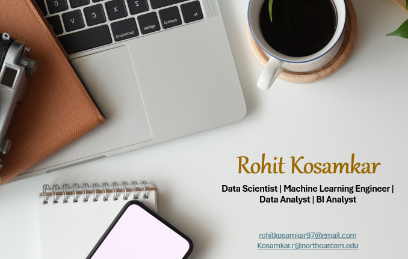

## Hi there 👋
<!-- Centering the image using HTML -->

  

## About Me

- **Current Role**: Graduate Research Assistant Data Scientist at the Northeastern DATA Initiative
- **Location**: Boston, Massachusetts, USA
- **Interests**: Machine Learning, Data Science, Large Language Models, MLOps,  Deep Learning, Open-Source Projects

## 📦 My Published Packages
- Check out my Python package EDAExcelReport (https://pypi.org/project/EDAExcelReport/) your go-to tool for effortless exploratory data analysis (EDA). With just a single line of code, you can generate comprehensive Excel reports, complete with statistics and visualizations, tailored for datasets with binary target variables. Simplify your EDA process today!

- Designed and published MLEssentials on PyPI, providing a one-stop solution for machine learning development by resolving version compatibility issues across libraries. Simplifies model building and deployment—just install via pip and start developing without dependency conflicts. (https://pypi.org/project/MLEssentials/)

- Designed and published WebScrapingTool on PyPI, to simplify the installation of essential web scraping libraries. With just one command, you can have access to all the major libraries needed to build and run web scrapers efficiently. (https://pypi.org/project/WebScrapingTool/)

## 🛠️ Tools

- **Language**: Python, SQL, HTML, CSS
- **Database**: MySQL, Google BigQuery, Azure, AWS
- **Visualization**: Tableau, Looker Studio, PowerBI
- **Concepts**: Big Data, Predictive Modeling, Recommender Systems, Web Scraping, Clustering, CI/CD, 
- **Software**: Docker, Hadoop, Postman, Jira, GitHub, Advanced Excel, Databricks, Sagemaker, Azure DevOps, Azure Machine Learning, Jenkins  
- **Certifications**:
  1. Databricks Generative AI
  2. Oracle Certified Generative AI Professional 2024
  3. Azure Fundamentals
  4. Gemini API by Google
  5. JPMorgan Chase – Investment Banking Job Simulation

## 💬 Ask me about ...
- Data Science, Machine Learning, and AI applications
- Large Language Models and Deep Learning
- Open-source contributions and projects
- Career in Data Science and Research

## 📫 How to reach me:
- Email: [kosamkar.r@northeastern.edu]
- LinkedIn: [Connect on LinkedIn](https://www.linkedin.com/in/rohit-kosamkar-177399195/)
- Twitter: [Follow me on Twitter](https://x.com/rohitkosamkar18)

## 😄 Pronouns: 
- He/Him 

## ⚡ Fun fact:
-  When I'm not training models, I'm training my arms at the gym! I enjoy pushing my limits with weightlifting and staying strong both mentally and physically.

<!--
**rohit180497/rohit180497** is a ✨ _special_ ✨ repository because its `README.md` (this file) appears on your GitHub profile.

Here are some ideas to get you started:

- 🔭 I’m currently working on ...
- 🌱 I’m currently learning ...
- 👯 I’m looking to collaborate on ...
- 🤔 I’m looking for help with ...
- 💬 Ask me about ...
- 📫 How to reach me: ...
- 😄 Pronouns: ...
- ⚡ Fun fact: ...
-->
