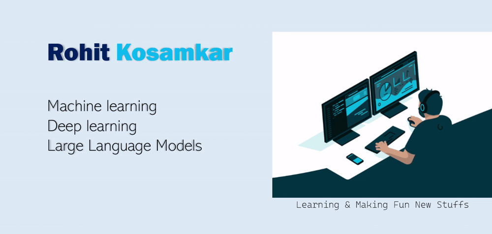

  

 

## **Hey there, I'm Rohit!**  

I am a **data science professional with 5 years of experience**, specializing in integrating machine learning models seamlessly into business operations across **Insurance, Banking, and Real Estate**.  

I am originally from India but currently living and working in **Boston, USA**. 
Taking one step at a time to be more mindful of my journey. You can find me here on to know more about me and my work.
__________________________________________________________________________________________________________________

    I love meeting and knowing new people. Let's connect and discuss ideas ~ 🤓

<h3 align="left">📦 My Published Packages</h3>

🔹 <a href="https://pypi.org/project/EDAExcelReport/" target="_blank"><b>EDAExcelReport</b></a> 🔹 <a href="https://pypi.org/project/MLEssentials/" target="_blank"><b>MLEssentials</b></a>  🔹 <a href="https://pypi.org/project/WebScrapingTool/" target="_blank"><b>WebScrapingTool</b></a>  

__________________________________________________________________________________________________________________
<h3 align="left">💼 Portfolio Projects </h3>

🔹 <a href="https://github.com/rohit180497/Coffee-Shop-AI-Agents" target="_blank"><b>Coffee Shop AI Agents</b></a>   &nbsp;&nbsp;&nbsp;&nbsp;&nbsp;&nbsp;&nbsp;&nbsp;&nbsp;&nbsp;&nbsp;&nbsp;&nbsp;&nbsp;&nbsp;&nbsp;&nbsp;&nbsp;&nbsp;&nbsp;&nbsp;&nbsp;&nbsp;&nbsp;&nbsp;&nbsp;&nbsp;&nbsp;&nbsp;&nbsp;               🔹 <a href="https://github.com/rohit180497/Early-readmission-of-patients-in-hospital" target="_blank"><b>Early Readmission of Patients in Hospital</b></a>  
🔹 <a href="https://github.com/rohit180497/Medicare-Claim-Fraud-Detection" target="_blank"><b>Medicare Claim Fraud Detection</b></a> &nbsp;&nbsp;&nbsp;&nbsp;&nbsp;&nbsp;&nbsp;&nbsp;&nbsp;&nbsp;&nbsp;&nbsp;&nbsp;&nbsp;     🔹 <a href="https://github.com/rohit180497/Medical-ChatBot-BioMistral7B" target="_blank"><b>Medical ChatBot - BioMistral7B</b></a>  
🔹 <a href="https://github.com/rohit180497/Video-To-QnA-RAG-Chatbot" target="_blank"><b>Video to QnA RAG Chatbot</b></a>

__________________________________________________________________________________________________________________
<h3 align="left">🛠️ Languages and Tools</h3>

                             

&nbsp;

## ⚡ Fun fact:
-  When I'm not training models, I'm training my arms at the gym! I enjoy pushing my limits with weightlifting and staying strong both mentally and physically.

  

<h3 align="left">Connect with me:</h3>

