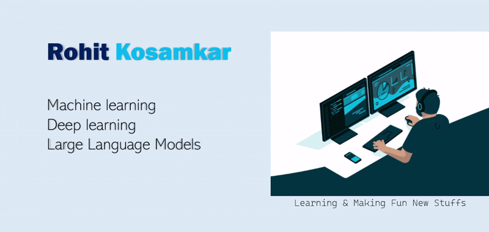
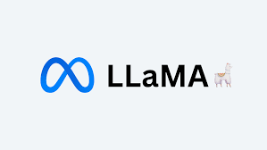
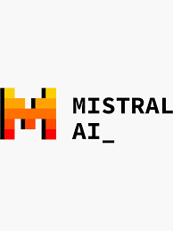
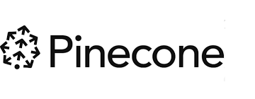
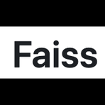

  

  <h3>🌐 Do Visit: <a href="https://www.rohitkosamkar.com" target="_blank">www.rohitkosamkar.com</a></h3>

 

## **Hey there, I'm Rohit!**  

I am a **data science professional with 5+ years of experience**, delivering end-to-end ML solutions across **Insurance, Banking, and Real Estate**. Proficient in **ML, DL, NLP, LLMs, and big data**, with expertise in model development, optimization, and scalable deployment. Adept at integrating AI into business workflows to drive automation, reduce costs, and support data-driven decision-making.

I am originally from India but currently living and working in **Boston, USA**. 
Taking one step at a time to be more mindful of my journey. You can find me here on  to know more about me and my work.
__________________________________________________________________________________________________________________ 

    

<h3 align="left">📦 My Published Packages</h3>

🔹 <a href="https://pypi.org/project/EDAExcelReport/" target="_blank"><b>EDAExcelReport</b></a> 🔹 <a href="https://pypi.org/project/pydbmanager/" target="_blank"><b>PyDBManager</b></a>  🔹 <a href="https://pypi.org/project/MLEssentials/" target="_blank"><b>MLEssentials</b></a>  🔹 <a href="https://pypi.org/project/WebScrapingTool/" target="_blank"><b>WebScrapingTool</b></a>  

<h3 align="left">📦 Hackathon Project</h3>

1st Place – Global AI Agents League | Fetch.ai Nexus Award | $10,000 Winner | Devpost Hackathon 
</b>
🔹 <a href="https://devpost.com/software/travelgenie-ai-agent" target="_blank"><b>TravelGenie AI-Agent </b></a>

<h3 align="left">📦 AI-Agents on Agentverse</h3>

🔹 <a href="https://agentverse.ai/agents/details/agent1qfetzztsmf373m7qa4x6l5mjveykecm87cu9m7myaxd7ukp0rwrjkkax9wt/profile" target="_blank"><b>Google API Route Agent</b></a>
🔹 <a href="https://agentverse.ai/agents/details/agent1q2zc0ctnxwyzd7xxgafwzwcd7tkzg7w790zjret9vwm2f38gmm5dv7wm22j/profile" target="_blank"><b>Weather Agent</b></a>  
🔹 <a href="https://agentverse.ai/agents/details/agent1q0vj2jq0xe05zdukwnesaqvey0sve99gahvfp452yrlemtng8axzvcf8hq0/profile" target="_blank"><b>Google Places Agent</b></a>  
🔹 <a href="https://agentverse.ai/agents/details/agent1qd3qj9wsjwdasgqu2w3gzwjgzc3cjx7pwdl26th3r67y46umgulwxu4emrg/profile" target="_blank"><b>Flight Search Agent</b></a>  
🔹 <a href="https://agentverse.ai/agents/details/agent1qtcaxwkqgs0kgfmtsr90j9lcpjk3a7t3mtkf9sty8a07gdr0el6sjgkzy60/profile" target="_blank"><b>Restaurant Explorer Agent</b></a>  
🔹 <a href="https://agentverse.ai/agents/details/agent1qvmkshe4kn3ucfsecd9d703jqzqy858z5l2unn9qye3y6dyvc5ph20zmqch/profile" target="_blank"><b>Event Explorer Agent</b></a>  
__________________________________________________________________________________________________________________
<h3 align="left">💼 Portfolio Projects </h3>

🔹 [**AI-Powered Coffee Shop - Chatbot Android Application**](https://github.com/rohit180497/Coffee-Shop-AI-Agents)  
🔹 [**Scalable Loan Default Prediction with CI/CD & MLOps on Azure**](https://github.com/rohit180497/NBFI-Loan-Repayment)  
🔹 [**AI-Driven Healthcare Risk Assessment & Cloud Deployment**](https://github.com/rohit180497/Early-readmission-of-patients-in-hospital)  
🔹 [**ML-Powered Fraudulent Claims Detection System with AWS Cloud**](https://github.com/rohit180497/Medicare-Claim-Fraud-Detection)  
🔹 [**Medical ChatBot - BioMistral7B**](https://github.com/rohit180497/Medical-ChatBot-BioMistral7B)  
🔹 [**Multimodal Video Intelligence: AI-Driven QnA System**](https://github.com/rohit180497/Video-To-QnA-RAG-Chatbot)  

__________________________________________________________________________________________________________________
<h3 align="left">🛠️ Tech Stack</h3>

<h4 align="left">📌 Languages & Frameworks</h4>

     
     
     
     
     
     
     
     
     
     
     
     
     
     

<h4 align="left">🔧 Tools & Platforms</h4>

     
     
     
     
     
     
     
     
     
     
     
     
     
     
    

<h4 align="left">🧠 GenAI</h4>

  
  
  
  
  
  
  

<!-- 
&nbsp;
 -->

## ⚡ Fun fact:
-  When I'm not training models, I'm training my arms at the gym! I enjoy pushing my limits with weightlifting and staying strong both mentally and physically.

  

<h3 align="left">Connect with me:</h3>

<picture>
  <source media="(prefers-color-scheme: dark)" srcset="https://raw.githubusercontent.com/rohit180497/rohit180497/output/github-snake-dark.svg" />
  <source media="(prefers-color-scheme: light)" srcset="https://raw.githubusercontent.com/rohit180497/rohit180497/output/github-snake.svg" />
  
</picture>
